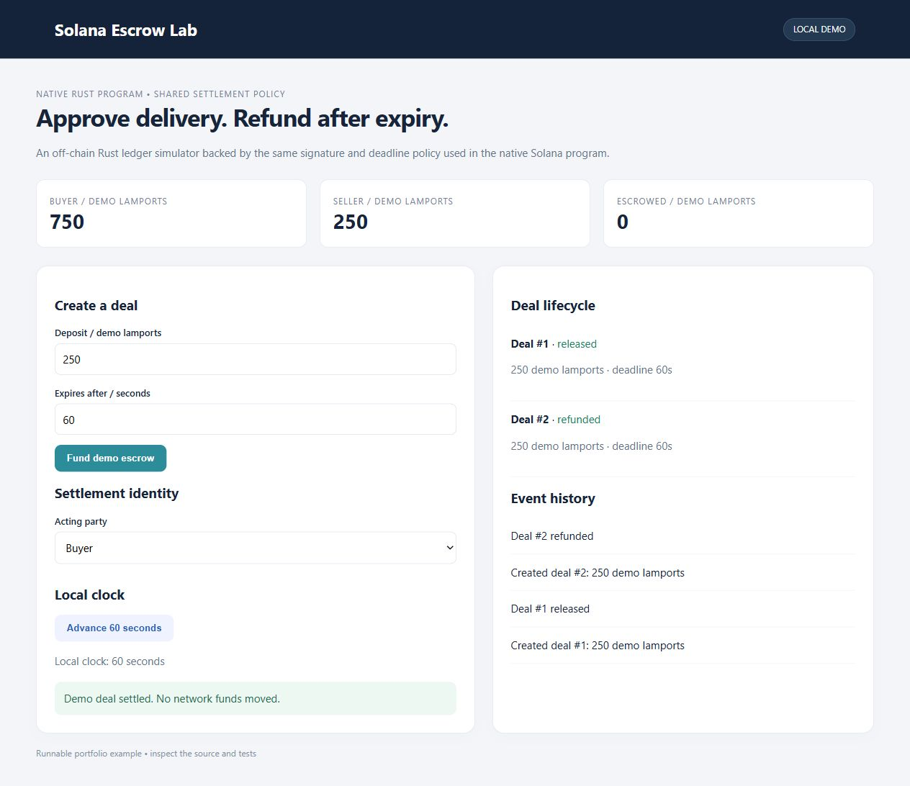

# Solana Escrow Lab

Native Rust/Solana SOL escrow with expiry refunds, signature checks and a runnable local state-machine dashboard.



## Local dashboard and tests
Rust stable and a native linker:
```sh
cargo test --locked --all-features
cargo run --locked --no-default-features --bin escrow-demo
```
Open http://127.0.0.1:8765; set `PORT` to change it. The dashboard runs the **off-chain Rust ledger simulator**, reusing the settlement policy from the Solana program. It does not contact a validator, create wallets or move SOL. State resets at restart. Demo amounts are labeled lamports.

## Native program
`program.rs` implements an 82-byte program-owned escrow account. Initialize requires both buyer and vault signatures, a future expiry and sufficient prefunded lamports above rent. Release requires the buyer signature before expiry and credits only the stored seller. Refund requires the buyer at/after expiry. Terminal states reject replays. Account owner, writable flags, keys, rent reserve and overflow are checked.

Instruction data is little-endian: `0 | amount:u64 | deadline:i64` to initialize, `1` to release, `2` to refund. Accounts in each instruction: writable vault, buyer signer (writable for refund), seller (writable for release). To initialize, a client must atomically create/fund an 82-byte account owned by the deployed program using SystemProgram.createAccount, then call initialize with the new vault keypair signature. The deposit is supplied during account creation; this is native SOL escrow, not an SPL-token escrow. Rent and any excess deposit remain in the terminal account; account closing is outside this sample.

With the Solana CLI and platform tools installed, build the program using `cargo build-sbf --no-default-features --features solana`. Public testnet deployment requires your own program keypair and CLI configuration. **No SBF build or devnet deployment is claimed here.** Verification covers native Rust tests and direct AccountInfo processor tests; it does not replace validator execution or an audit. See [Solana native Rust program documentation](https://solana.com/docs/programs/rust).

## Design and limits
`lib.rs` defines the shared approval/expiry policy and simulator; `program.rs` enforces on-chain account constraints; `main.rs` serves a bounded loopback HTTP demo. Tests exercise balance conservation, expiry boundaries, unauthorized settlement, double settlement and native account transfers. The minimal synchronous HTTP server has no production authentication or TLS. This is a portfolio example, not audited deployment software.
